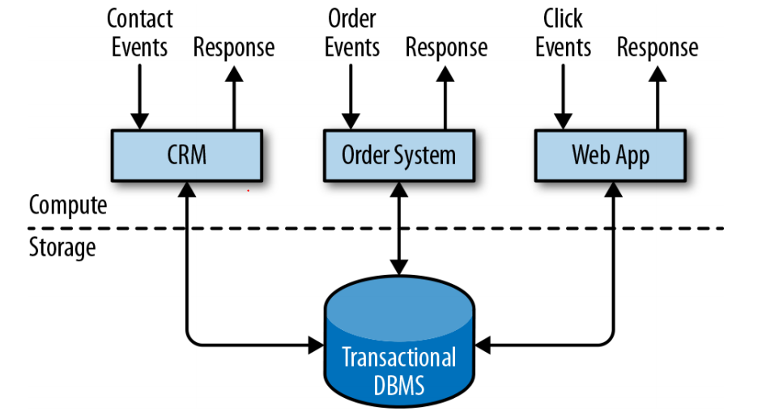
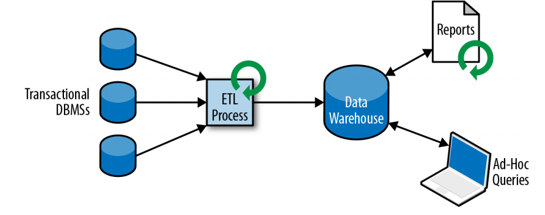
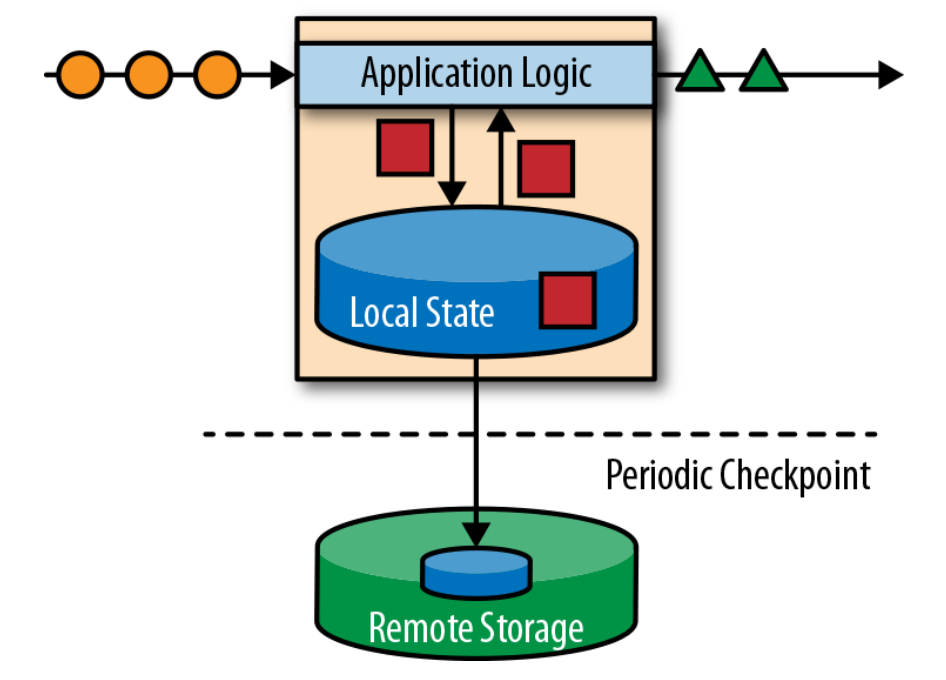
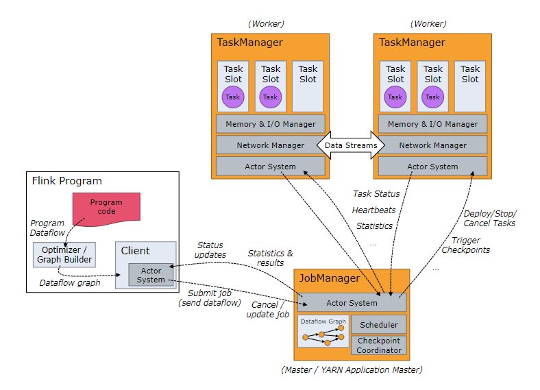
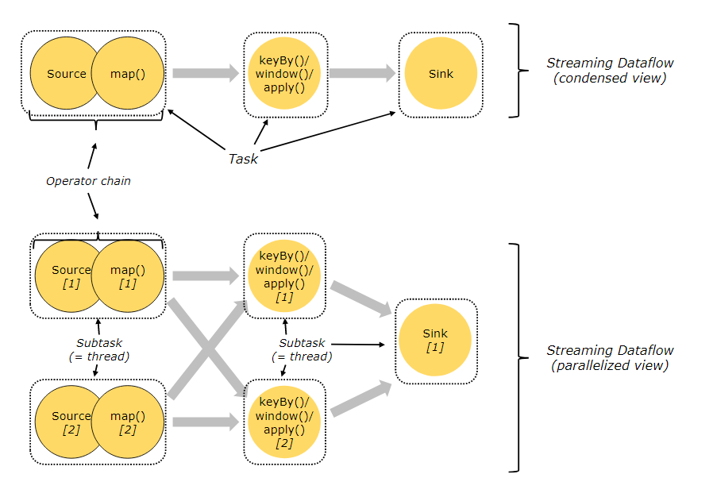
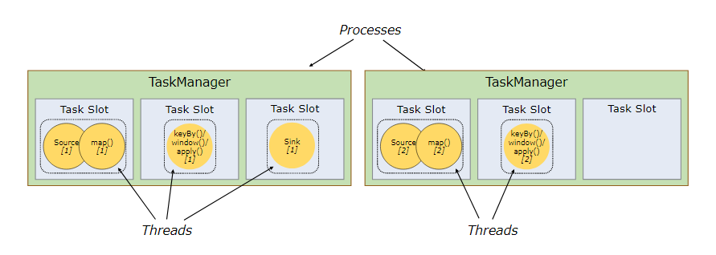
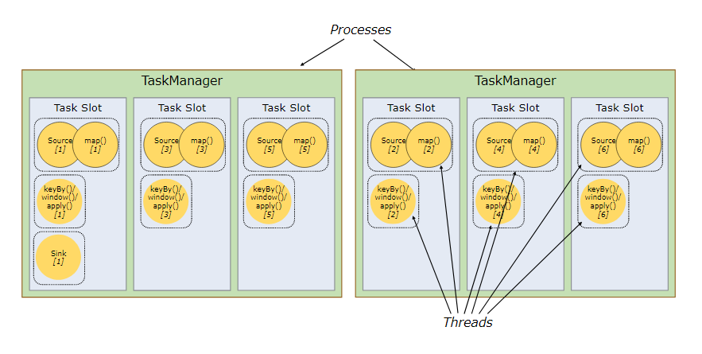

# Flink 
> Apache Flink is a framework and distributed processing engine 
> for stateful computations over unbounded and bounded data streams.

> Apache Flink 是一个框架和分布式计算引擎，对无界和有界数据流进行状态计算。

### 为什么使用 Flink
> 流式数据更真实地反映了我们的生活。(实时处理 engine 产生的数据)
> <br/>
> 传统的数据架构式基于有限数据集的
> <br/>
> 我们的目标: 低延迟 高吞吐 结果的准确性和良好的容错性

### 哪些行业需要处理流数据
- 电商和市场营销
  > 数据报表，广告投放，业务流程需要
- 物联网(IOT)
  > 传感器实时数据采集和显示，实时报警，交通运输调度
- 电信业
  > 基站流量调配
- 银行和金融业
  > 实时结算和通知推送，实时检测异常行为

### 传统数据处理架构
- 事务处理

- 分析处理


### 有状态的流式处理

           
### FLink 的主要特点
- 事件驱动(Event-driven)
- 基于流的世界观
    > 在 Flink 的世界观中，一切都是由流组成的，离线数据是有界的流，实时数据是一个没有界限的流。
- 分层API
    > [High-level] SQL/Table API(dynamic tables)<br>
      [Stream-& Batch Data Processing] DataStream API(streams, windows)<br>
      [Stateful Event-Driven Applications] ProcessFunction(events, state, time)<br>
- 事件时间(event-time)和处理时间(processing-time)
- 精确一次(exactly-once)的状态一致性
- 低延迟，每秒处理数百万个事件，毫秒级延迟
- 与众多常用存储系统的连接
- 高可用，动态扩展，实现7*24小时全天候运行
    
### Flink 集群搭建
> 解压 flink <br>
> bin 目录包含各种 flink 命令 <br>
> conf 目录包含各种集群配置文件

[flink-conf.yaml]
```yaml
################################################################################
#  Licensed to the Apache Software Foundation (ASF) under one
#  or more contributor license agreements.  See the NOTICE file
#  distributed with this work for additional information
#  regarding copyright ownership.  The ASF licenses this file
#  to you under the Apache License, Version 2.0 (the
#  "License"); you may not use this file except in compliance
#  with the License.  You may obtain a copy of the License at
#
#      http://www.apache.org/licenses/LICENSE-2.0
#
#  Unless required by applicable law or agreed to in writing, software
#  distributed under the License is distributed on an "AS IS" BASIS,
#  WITHOUT WARRANTIES OR CONDITIONS OF ANY KIND, either express or implied.
#  See the License for the specific language governing permissions and
# limitations under the License.
################################################################################


#==============================================================================
# Common
#==============================================================================

# The external address of the host on which the JobManager runs and can be
# reached by the TaskManagers and any clients which want to connect. This setting
# is only used in Standalone mode and may be overwritten on the JobManager side
# by specifying the --host <hostname> parameter of the bin/jobmanager.sh executable.
# In high availability mode, if you use the bin/start-cluster.sh script and setup
# the conf/masters file, this will be taken care of automatically. Yarn/Mesos
# automatically configure the host name based on the hostname of the node where the
# JobManager runs.

jobmanager.rpc.address: localhost

# The RPC port where the JobManager is reachable.

jobmanager.rpc.port: 6123


# The total process memory size for the JobManager.
#
# Note this accounts for all memory usage within the JobManager process, including JVM metaspace and other overhead.

jobmanager.memory.process.size: 1600m


# The total process memory size for the TaskManager.
#
# Note this accounts for all memory usage within the TaskManager process, including JVM metaspace and other overhead.
# taskmanager 节点总体使用的内存，包括 JVM 和其他的内存占用
taskmanager.memory.process.size: 1728m

# To exclude JVM metaspace and overhead, please, use total Flink memory size instead of 'taskmanager.memory.process.size'.
# It is not recommended to set both 'taskmanager.memory.process.size' and Flink memory.
#
# taskmanager 节点 Flink 运算使用的内存，不包括 JVM 和其他的内存占用， 仅包含Flink 使用的内存
# taskmanager.memory.flink.size: 1280m

# The number of task slots that each TaskManager offers. Each slot runs one parallel pipeline.
# taskmanager 包含的 slots， 每个 slot 可以运行一个并行的 pipeline
# slots 是  taskmanager 包含的运算资源
taskmanager.numberOfTaskSlots: 1

# The parallelism used for programs that did not specify and other parallelism.
# 算子的默认并行度
parallelism.default: 1

# The default file system scheme and authority.
#
# By default file paths without scheme are interpreted relative to the local
# root file system 'file:///'. Use this to override the default and interpret
# relative paths relative to a different file system,
# for example 'hdfs://mynamenode:12345'
#
# fs.default-scheme

#==============================================================================
# High Availability
#==============================================================================

# The high-availability mode. Possible options are 'NONE' or 'zookeeper'.
#
# high-availability: zookeeper

# The path where metadata for master recovery is persisted. While ZooKeeper stores
# the small ground truth for checkpoint and leader election, this location stores
# the larger objects, like persisted dataflow graphs.
#
# Must be a durable file system that is accessible from all nodes
# (like HDFS, S3, Ceph, nfs, ...)
#
# high-availability.storageDir: hdfs:///flink/ha/

# The list of ZooKeeper quorum peers that coordinate the high-availability
# setup. This must be a list of the form:
# "host1:clientPort,host2:clientPort,..." (default clientPort: 2181)
#
# high-availability.zookeeper.quorum: localhost:2181


# ACL options are based on https://zookeeper.apache.org/doc/r3.1.2/zookeeperProgrammers.html#sc_BuiltinACLSchemes
# It can be either "creator" (ZOO_CREATE_ALL_ACL) or "open" (ZOO_OPEN_ACL_UNSAFE)
# The default value is "open" and it can be changed to "creator" if ZK security is enabled
#
# high-availability.zookeeper.client.acl: open

#==============================================================================
# Fault tolerance and checkpointing
#==============================================================================

# The backend that will be used to store operator state checkpoints if
# checkpointing is enabled.
#
# Supported backends are 'jobmanager', 'filesystem', 'rocksdb', or the
# <class-name-of-factory>.
#
# state.backend: filesystem

# Directory for checkpoints filesystem, when using any of the default bundled
# state backends.
#
# state.checkpoints.dir: hdfs://namenode-host:port/flink-checkpoints

# Default target directory for savepoints, optional.
#
# state.savepoints.dir: hdfs://namenode-host:port/flink-checkpoints

# Flag to enable/disable incremental checkpoints for backends that
# support incremental checkpoints (like the RocksDB state backend).
#
# state.backend.incremental: false

# The failover strategy, i.e., how the job computation recovers from task failures.
# Only restart tasks that may have been affected by the task failure, which typically includes
# downstream tasks and potentially upstream tasks if their produced data is no longer available for consumption.
# 发生故障时，

jobmanager.execution.failover-strategy: region

#==============================================================================
# Rest & web frontend
#==============================================================================
# Flink 的管理平台 ，默认为 master 节点的 8081 端口
# The port to which the REST client connects to. If rest.bind-port has
# not been specified, then the server will bind to this port as well.
#
#rest.port: 8081

# The address to which the REST client will connect to
#
#rest.address: 0.0.0.0

# Port range for the REST and web server to bind to.
#
#rest.bind-port: 8080-8090

# The address that the REST & web server binds to
#
#rest.bind-address: 0.0.0.0

# Flag to specify whether job submission is enabled from the web-based
# runtime monitor. Uncomment to disable.

#web.submit.enable: false

#==============================================================================
# Advanced
#==============================================================================

# Override the directories for temporary files. If not specified, the
# system-specific Java temporary directory (java.io.tmpdir property) is taken.
#
# For framework setups on Yarn or Mesos, Flink will automatically pick up the
# containers' temp directories without any need for configuration.
#
# Add a delimited list for multiple directories, using the system directory
# delimiter (colon ':' on unix) or a comma, e.g.:
#     /data1/tmp:/data2/tmp:/data3/tmp
#
# Note: Each directory entry is read from and written to by a different I/O
# thread. You can include the same directory multiple times in order to create
# multiple I/O threads against that directory. This is for example relevant for
# high-throughput RAIDs.
#
# io.tmp.dirs: /tmp

# The classloading resolve order. Possible values are 'child-first' (Flink's default)
# and 'parent-first' (Java's default).
#
# Child first classloading allows users to use different dependency/library
# versions in their application than those in the classpath. Switching back
# to 'parent-first' may help with debugging dependency issues.
#
# classloader.resolve-order: child-first

# The amount of memory going to the network stack. These numbers usually need
# no tuning. Adjusting them may be necessary in case of an "Insufficient number
# of network buffers" error. The default min is 64MB, the default max is 1GB.
#
# taskmanager.memory.network.fraction: 0.1
# taskmanager.memory.network.min: 64mb
# taskmanager.memory.network.max: 1gb

#==============================================================================
# Flink Cluster Security Configuration
#==============================================================================

# Kerberos authentication for various components - Hadoop, ZooKeeper, and connectors -
# may be enabled in four steps:
# 1. configure the local krb5.conf file
# 2. provide Kerberos credentials (either a keytab or a ticket cache w/ kinit)
# 3. make the credentials available to various JAAS login contexts
# 4. configure the connector to use JAAS/SASL

# The below configure how Kerberos credentials are provided. A keytab will be used instead of
# a ticket cache if the keytab path and principal are set.

# security.kerberos.login.use-ticket-cache: true
# security.kerberos.login.keytab: /path/to/kerberos/keytab
# security.kerberos.login.principal: flink-user

# The configuration below defines which JAAS login contexts

# security.kerberos.login.contexts: Client,KafkaClient

#==============================================================================
# ZK Security Configuration
#==============================================================================

# Below configurations are applicable if ZK ensemble is configured for security

# Override below configuration to provide custom ZK service name if configured
# zookeeper.sasl.service-name: zookeeper

# The configuration below must match one of the values set in "security.kerberos.login.contexts"
# zookeeper.sasl.login-context-name: Client

#==============================================================================
# HistoryServer
#==============================================================================

# The HistoryServer is started and stopped via bin/historyserver.sh (start|stop)

# Directory to upload completed jobs to. Add this directory to the list of
# monitored directories of the HistoryServer as well (see below).
#jobmanager.archive.fs.dir: hdfs:///completed-jobs/

# The address under which the web-based HistoryServer listens.
#historyserver.web.address: 0.0.0.0

# The port under which the web-based HistoryServer listens.
#historyserver.web.port: 8082

# Comma separated list of directories to monitor for completed jobs.
#historyserver.archive.fs.dir: hdfs:///completed-jobs/

# Interval in milliseconds for refreshing the monitored directories.
#historyserver.archive.fs.refresh-interval: 10000

```
 [masters] 
 ```yaml
 # jobmanager
 localhost:8081
 ```
 [workers]
  ```yaml
 # taskmanager 的主机名，注意 host文件中 主机名和 ip映射
 localhost
 ```

### Flink 提交 job
 图形界面
 Submit New Job (可以观察job plan，日志，标准输出)\
 命令行 \
 提交 job \
 ./bin/flink run -c 主类名 -p 并行度 jar包路径 \
 取消 job \
 ./bin/flink cancel JobID \
 查看当前全部 job \
 ./bin/flink list
 
 Yarn 提交 \
 要求 Flink 是有 Hadoop 支持的版本， Hadoop环境需要 2.2 以上\
 可以下载相应的 jar 放在 lib 目录获得 hadoop 的支持
 
 Session-cluster 模式\
 需要先在yarn上启动集群，再提交 job， job之间共享 ResourceManager \
 启动 yarn-session \
 ./bin/yarn-session.sh -s slot数(一般一个core一个slot) -jm jobmanager内存 -tm taskmanager 内存 nm nodemanager名字(启动好的yarn) -d (后台运行) \
 提交任务和之前的命令相同(job的状态需要去yarn的管理页面查看) 
 
 Pre-job-cluster 模式\
 一个 job 独占一个 Flink 集群，每提交一个作业会单独向 yarn 申请资源， job之间互不影响，适合大规模长时间运行的job\
 直接提交job \
 ./bin/flink run -m yarn集群名字 -c 主类名 -p 并行度 jar包路径 

### Flink 运行时架构
- JobManager \
  控制应用程序执行的主进程，每个job会被一个不同的 JobManager 执行\
  JobManager 会先接收到要执行的应用程序，这个应用程序包括 JobGraph, Logical dataflow graph 和打包了所有类库和其他资源的Jar包 \
  JobManager 会把JobGraph 转换成一个物理层面的数据流图，这个图叫 ExecutionGraph 包含所有可以并发执行的任务 \
  JobManager 向 ResourceManager 请求执行任务必要的资源，也就是 TaskManager 上的 slot。一旦获取到足够的资源就会将ExecutionGraph分发到TaskManager上。运行的过程当中 JobManager负责所有需要中央协调的操作，比如 checkpoints。
- TaskManager \
  Flink 的工作进程。通常会有多个TaskManager，每一个都包含一定数量的 slot，slot的数量限制了 TaskManager能够执行任务的数量。\
  启动之后TaskManager会像ResourceManager注册它的slot，收到ResourceManager的指令后，TaskManager会将一个或多个slot提供给JobManager调用。JobManager就可以向slot分配 task。\
  在执行过程当中，一个TaskManager可以跟其他运行同一应用程序的TaskManager交换数据。
- ResourceManager \
  主要负责 TaskManager 的 slot， slot是Flink中定义的资源单位。\
  Flink 为不同的环境和资源管理工具提供了不同的ResourceManager，比如Yarn Mesos K8s\
  当JobManager 申请 slot 时，ResourceManager会将空闲的 slot 分配给 JobManager，如果它没有足够的资源，它还可以向资源管理平台发起会话，申请启动 TaskManager 的容器。
- Dispatcher \
  为应用提供 Rest接口\
  当一个job被提交执行，Dispatcher就会启动，并将应用移交给JobManager \
  Dispatcher也会启动一个 WebUI 用于监控和展示 Job的执行信息。 \
  Dispatcher在架构中不是必须的，取决于应用的提交方式。

### Flink Job 提交流程
- standalone
  1. App 提交 Job
  2. Dispatcher 启动并提交 Job 给 JobManager
  3. JobManager 向 ResourceManager 请求 slots
  4. ResourceManager 启动 TaskManager
  5. TaskManager 向ResourceManager 注册 slots
  6. ResourceManager 向 TaskManager 申请 slots 
  7. TaskManager 向 JobManager 提供 slots
  8. JobManager 向 TaskManager 提交要执行的 task
  9. TaskManager 之间进行数据交换，完成运算。

- yarn 提交
  1. FlinkClient 向 HDFS 上传Flink的 Job 的jar和配置
  2. FlinkClient 向 yarn 的 ResourceManager 提交Job
  3. yarn 的 ResourceManager 启动 ApplicationMaster，这个 ApplicationMaster 包含着 Flink 的 JobManager
  4. Flink 的 JobManager Flink 的 ResourceManager 申请启动 TaskManager
  5. Flink 的 ResourceManager 向 yarn 的 ResourceManager 申请启动包含着TaskManager 的 Container

### Flink 任务调度



**Tasks and Operator Chains**\
为了分布式的执行，Flink 将算子的subtask链在一起形成 tasks ，每个 task 交由一个 thread 运行。它减少了线程间切换和缓冲的开销，提高了吞吐量，减少了延迟.

**并行度** \
算子的子任务 subtask 的个数被称作并行度，一个job的并行度是所有算子的最大的并行度\
env.setParallelism -> ./bin/flink -p -> parallelism.default: 1\


**TaskManager & Slot** \
Flink 中的每个 TaskManager 都是一个JVM进程，它可能会在独立的线程上执行一个或多个subtask。 \
为了控制一个 TaskManager 能接收多少个 task，TaskManager 通过 slot 来进行控制(一个 TaskManager 至少有一个 slot) \
每个 slot 占有 TaskManager 的一部分资源，比如有 3个slot 的 TaskManager会将内存资源均分给三个 slot。不同的subtask运行时不会争抢内存，但是CPU资源不会进行隔离。\
如果一个 TaskManager只有一个 slot，意味着一个 subtask group独享一个 JVM，如果有多个 slot，那么subtask共享一个 JVM 。同一个 JVM 中的 subtask共享TCP连接和心跳，也可以共享数据集和数据结构，从而减少任务的开销。\


**Slot Sharing** \
相同时序的不同 task 的 subtask 可以共享 slot。\
默认情况下，Flink 允许 subtask 共享 slot，即使他们是不同任务的 subtask ，这样一个 slot 可以保存 job 的整个 pipeline。\
slot 是静态的概念，表示 TaskManager 的并发能力。\


### 程序与数据流DataFlow
> 所有的 Flink 程序都是由三部分组成
- Source: 数据源
- Transformations: 算子
- Sink: 输出

Flink 上运行的程序会被映射成DataFlow，它包含了以上三部分\
每一个 DataFlow 以一个或多个 Sources 开始，以一个或多个 Sinks 结束。 DataFlow 类似于任意的有向无环图(DAG)\
在大部分情况下，程序中的Transformations跟DataFlow中的算子是一一对应的。

**Execution Graph**\
Flink 中的执行图分为四层:
  - StreamGraph: 根据用户通过 StreamAPI编写的代码生成的最初的图，用来表示程序的拓扑结构。
  - JobGraph: 优化StreamGraph，将符合条件的 subtask chain 在一起
  - ExecutionGraph: JobGraph的并行版本，调度层最核心的数据结构
  - PhysicalGraph: JobManager根据ExecutionGraph进行调度后各个TaskManager上部署Task形成的图，不是数据结构。

**数据传输**\
不同的算子可以有不同的并行度。 \
算子之间传输数据可以有两种模式，具体取决于算子的类型: 
- one-to-one(forwarding):  source ，map， fliter 等
- redistributing: stream 的分区发生改变，每种算子的 subtask 根据相应的 tarnsformation 发送数据到不同的分区。比如 keyBy (hashCode)， broadcast和rebalance(随机)。这些算子会引起 redistributing，redistributing的过程类似 Spark 的 shuffle。

*所以相同并行度的 one-to-one 操作可以合并为 Operater Chain*\
.disableChaining() 可以强制前后都断开 Operater Chain\
.startNewChain() 可以强制断开 Operater Chain, 开启新的 Operater Chain \
.slotSharingGroup("gourpName") 规定从当前算子及之前算子的subtask可以共享一个 slot \
env.disableOpertorChaining 全局禁止生成 Operater Chain\

### Source
```java 
// fileSource
// collectionSource
// kafkaSource
// customerSource
```
### Transform
```java
/*
map
flatmap
filter
sum
min
minBy
reduce
split
select
connect
coMap
coFlatMap
union
*/
```
### 数据类型
```java
// 基础数据类型(包装类型)
// Tuple
// scala样例类，Java的POJO(必须有空参数的构造方法)
// Array List Enum 等集合
```

### UDF函数类
```java
// Flink 暴露了所有 udf 的函数接口，比如
// MapFunction FilterFunction ProcessFunction
class Test {
    DataStream<String> flinkTweets = tweets.filter(new FlinkFilter());
    public static class FlinkFilter(String value) implements FilterFunction<String> {
        @Override
        public boolean filter(String value) throws Exception {
            return value.contains("flink");
        }
    }
    DataStream<String> flinkTweets = tweets.filter( value -> (value.contains("flink")));
}

// 富函数
// RichFunctions

```

### 重分区
```java
class Test {
    public static void main(String[] args) {
        DataStream<String> dataStream = env.addSource(new SensorSource());
        // 除了 keyBy 可以利用 key 的 hashCode 进行重分区，还有其他算子可以进行重分区
        // 自定义发送至下游的哪个分区        
        dataStream.partitionCustom(partitioner, "someKey");
        dataStream.partitionCustom(partitioner, 0);
        // 随机分配到下游
        dataStream.shuffle();
        // 用轮询的方式，将数据平均分配给下游
        dataStream.rebalance();
        // 分组重分区，比如只想在当前 pipeline 下重新分发数据，减少网络传输。
        dataStream.rescale();
        // 广播至下游全部分区
        dataStream.broadcast();
        // 所有数据发送至下游的第一个实例
        dataStream.global();
    }
}
```

### Sink
```java

```
### window API
数据流都是无界的，把无限的数据流进行切分，得到的有限数据集进行处理
window 就是将无限的流切割为有限流的一种方式，它会将流数据分发到有限大小的桶(bucket)中。
window 的类型：
- TimeWindow
    - 滚动时间窗口
    - 滑动时间窗口
    - 会话窗口
- CountWindow
    - 滚动计数窗口
    - 滑动计数窗口

**滚动时间窗口(Tumbling Windows):**\
    将数据依据固定的窗口长度对数据进行切分。\
    时间对齐，窗口长度固定，没有重叠。
    window size\
**滑动时间窗口(Sliding Windows):**\
    滑动窗口是固定窗口的更广义的形式，由窗口大小和滑动间隔组成。\
    窗口长度固定，可以有重叠。\
    window size & window slid \
**会话窗口(Session Windows):**\
    由一系列事件组合一个指定时间长度的 timeout 间隙组成，也就是一段时间没有接收到新数据就会生成新的窗口。\
    时间没有对齐。\
    session gap
```java
// 窗口分配器 :
// tumbling window, sliding window, session window, global window
// 可以用 window() 方法来定义一个窗口，然后基于这个 window 去做一些聚合或者其他处理操作
// window() 方法必须在 keyBy() 之后
// flink 也提供了简单的 timeWindow() countWindow()方法用于定义时间窗口和计数窗口
```

### window function
对window中的数据进行操作\
- 增量聚合函数(每条数据到来就进行计算，保持一个简单的状态)
    ReduceFunction AggregateFunction
- 全窗口函数(把窗口中的所有数据都收集起来，等计算的时候进行遍历)
    ProcessWindowFunction WindowFunction
    
### window API
```java
/*
    .trigger() 触发器，定义 window 什么时候关闭，触发计算并输出结果
    .evictor() 移除器，定义移除某些数据的逻辑。
    .allowedLateness() 允许处理迟到数据
    .sideOutputLateData() 将迟到的数据放入侧输出流
    .getSideOutput() 获取侧输出流
*/
```    
### 时间语义
- Event Time: 事件创建的事件
- Ingestion Time: 数据进入 Flink 的时间
- Processing Time: 执行操作算子的本地系统时间，与机器相关。

通常更关心 Event Time， 乱序一般也是基于 Event Time 而言
```java
// 默认为 Processing Time 的时间语义
```

### watermark
当一个时间戳达到关闭窗口的时间，不应该立刻触发窗口计算，而是等待一段时间，等迟到的数据来了再关闭窗口。\
watermark 是一种衡量EventTime进展的机制，可以设定延迟触发\
watermark 是用于处理乱序事件的，而正确的处理乱序事件，通常用 watermark + window来实现\
数据流中的 watermark 用于表示 timestamp 小于 watermark 的数据都已经到达了，所以window的执行也是由watermark触发的\
watermark 用来让程序自己平衡延迟和结果正确性。\
watermark 是一条特殊的记录\
watermark 必须单调递增，以确保任务的事件时间始终在向前推进。\
watermark 与数据的时间戳相关\

watermark 的时间是当前 EventTime - 延迟时间，窗口关闭时间以 watermark 为准。

watermark 的传递：\
上游的 task 会将当前的 watermark 广播发送至下游\
下游的 task 会对上游发送过来的每个分区的 watermark 进行记录，并以所有分区最小的 watermark 作为当前task的 watermark
(并行度不为 1 时，观察 watermark 的传递)
### 状态管理
由一个 task 维护，并且用来计算某个结果的所有数据，都属于这个 task 的 state。\
可以认为 state 就是一个本地变量，可以被 task 的业务逻辑访问。\
Flink 会进行状态管理，包括状态一致性、故障处理以及高效存储和访问，以便开发人员可以专注于应用程序的逻辑。\
Flink 中状态始终与特定算子相关\
为了使运行时 Flink 了解算子的状态，算子需要预先注册其状态\
- 算子状态 Operator State
    算子状态作用范围为算子任务，同一 task 的所有并行 subtask 只能访问当前 subtask 的状态\
    数据结构：\
    列表状态(List State) 一组数据的列表\
    联合列表状态(Union List State) 区别于列表状态，从checkpoint恢复故障时将 state 发送给全部恢复的节点\
    广播状态(Broadcast State) 每个 task 的 subtask 的状态都相同\
- 键控状态 Keyed State
    根据数据流中定义的 key 来维护和访问 state\
    Flink为每个key维护一个状态实例，并将具有相同key的所有数据，都分区到同一个算子任务中，这个任务会维护这个key的状态\
    数据结构：
    - valueState
    - ListState
    - MapState
    - ReducingState
    - AggregatingState
- 状态后端 State Backend
    每传入一条数据，有状态的算子任务都会读取和更新状态\
    由于有效的状态访问对于处理数据的低延迟至关重要，因此每个并行任务都会在本地维护其状态，以确保快速的状态访问\
    状态的存储、访问以及维护，由一个可插入的组件决定，这个组件是状态后端(State backend)\
    状态后端主要负责两件事: 本地的状态管理，以及将checkpoint状态写入远程。\
    - MemoryStateBackend
        内存级的状态后端，将 state 作为内存中的对象管理，将 checkpoint 也保存在内存中
    - FsStateBackend
        将 checkpoint 存到远程的持久化文件系统上，本地 state 保存在内存中
    - RocksDBStateBackend
        将所有状态序列化后，存入本地的RocksDB
   
可以在 flink-conf.yaml 中配置
 ```yaml
# jobmanager filesystem rocksdb
state.backend: filesystem    
```   
代码中也可以设置
```java

```

### Process Function Api
普通的转换算子无法访问 Event 的时间戳和watermark信息(比如 MapFunction)。\
基于此，DataStream API 提供了一系列 Low-Level 的转换算子。可以访问时间戳、watermark 以及注册定时事件。\
还可以输出特定的一些事件，例如超时事件等。 \
ProcessFunction 用来构建事件驱动的应用以及实现自定义的业务逻辑(window函数和普通转换算子无法实现)。\
例如 Flink SQL 就是使用 Process Function 实现的。\     
Flink 提供了 8 个 Process Function( 基于不同的DataStream )：
- ProcessFunction
- KeyedProcessFunction
- CoProcessFunction
- ProcessJoinFunction
- BroadcastProcessFunction
- KeyedBroadcastProcessFunction
- ProcessWindowFunction
- ProcessAllWindowFunction

最常用的 KeyedProcessFunction
```java
// 生命周期方法
// open()
// close()
// 上下文
// context.output() // 分流操作
// context.getCurrentKey()
// 定时器
// context.timerService().currentProcessingTime();
// context.timerService().currentWatermark();
// context.timerService().registerProcessingTimeTimer(ts);
```

### 容错机制
**一致性检查点(checkpoint)**\
Flink 故障恢复机制的核心，就是应用状态的一致性检查点(checkpoint)\
有状态流应用的一致性检查点，其实就是所有任务的状态，在某个时间点的一份拷贝(一份快照)；\
这个时间点，应该是**所有任务**都恰好处理完一个相同的输入数据的时候

**从检查点恢复状态**
执行流应用程序期间，Flink会定期保存状态的一致性检查点\
如果发生故障，Flink将会使用最近的 checkpoint 来一致恢复应用程序的状态，并重新启动处理流程。

1. 遇到故障后，第一步先重启应用
2. 从 checkpoint 中读取状态，将状态重置
    从 checkpoint 重启应用程序后，其内部状态与 checkpoint 完成时的状态完全相同。
3. 开始消费并处理 checkpoint 到发生故障之间的所有数据
    这种 checkpoint 的保存和恢复机制可以为应用程序提供 exactly-once 的一致性，因为所有算子都会保存 checkpoint 并恢复其所有状态\
    这样一来所有的输入流就都会被重置到检查点完成时的位置。
    
**checkpoint 的实现算法**
- 一种简单的想法
    暂停应用，保存状态到 checkpoint，再重新恢复应用
- Flink 的改进实现
    基于 Chandy-Lamport 算法的分布式快照\
    将 checkpoint 的保存和数据处理分离开，不暂停整个应用。 \
    Checkpoint Barrier 检查点分界线 \
    Flink 的 checkpoint 算法用到了一种称为分界线的特殊数据形式，用来把一条流上的数据按照不同的 checkpoint 分开\
    分界线之前到来的数据导致的状态更改，都会被包含在当前分界线所属的 checkpoint 中；而基于分界线之后的数据导致的所有更改，就会被包含在之后的 checkpoint 中。

    JobManager 会向每个 source 任务发送一条带有新 checkpoint id 的消息，通过这种方式来启动 checkpoint\
    source 将他们的状态写入 checkpoint 并发出一个 checkpoint barrier\
    state backend 在 state 存入 checkpoint 后，会返回通知给source， source 就会向 JobManager 确认 checkpoint 完成。\
    分界线对齐：\
        barrier 向下游传递，subtask 会等待所有输入分区的 barrier 到达\
        对于 barrier 已经到达的分区，继续到达的数据会被缓存\
        而 barrier 尚未到达的分区，数据会被正常处理\     
    Sink 收到 barrier ，向JobManager 确认 state 保存到 checkpoint 完毕\
    当所有任务都确认成功将状态保存到 checkpoint 时，checkpoint 就真正完成了

**savepoints**

Flink 还提供了一个自定义的镜像保存功能，就是 savepoints\
原则上，创建 savepoints 使用的算法与 checkpoint 完全相同，因此 savepoints 可以认为就是具有一些额外元数据的 checkpoint\
Flink 不会自动创建 savepoints， 因此用户必须明确地触发创建操作(或者外部命令)\
savepoints 是一个强大的功能。除了故障恢复外，savepoints可以用于：有计划的备份，更新应用程序，版本迁移，暂停和重启应用等。

具体的配置
```java
// 默认 checkpoint 是不开启的，需要手动配置开启
```

### 状态一致性
有状态的流处理，内部每个算子任务都可以有自己的状态\
对于流处理器内部来说，所谓的状态一致性，其实就是我们所说的计算结果要保证准确\
一条数据不应该丢失，也不应该重复计算\
在遇到故障时可以恢复状态，恢复以后的重新计算，结果应该也是完全正确的。
- AT-MOST-ONCE 最多一次
    当任务故障时，最简单的做法是什么都不干，既不恢复丢失的状态，也不重播丢失的数据\
    最多处理一次事件。
- AT-LEAST-ONCE 至少一次
    大多数的真实场景，我们希望不丢失事件，至少一次意思是所有的事件都得到了处理，而一些事件还可能被多次处理。
- EXACTLY-ONCE 精确一次
    恰好处理一次是最严格的保证，也是最难实现的，恰好处理一次语义不仅仅以为着事件没有丢失，还意味着每个数据内部状态仅仅更新一次。    

端到端(end-to-end)的状态一致性\
真实的应用中，处理Flink内部的状态一致性还应该考虑外部数据源和输出到持久化系统的一致性。\
端到端的状态一致性必须贯穿整个pipeline，每一个组件都要保证它自己的一致性。\
- 内部： Checkpoint
- Source端： 可重设的数据 offset
- Sink端： 从故障恢复时，数据不会重复写入外部系统\
    幂等写入\
        一个操作，可以重复执行很多次，但只导致一次结果更改。(多次执行得到相同的结果)\
    事务写入\
        应用程序的所有操作都成功完成才会写入，否则所有更改都会撤销\
        具有原子性，所有操作要么全成功，要么全失败\
        实现方式：事务对应着 checkpoint，当 checkpoint 成功才写入结果
         - 预写日志 Write-Ahead-Log WAL
            把结果数据先当成状态保存，在收到 checkpoint 完成的通知时一次性写入Sink
            DataStreamApi提供了一个模板 GenericWriteAheadSink 来实现事务性 Sink
         - 两段提交 Two-Phase-Commit 2PC(可以实现 EXACTLY-ONCE)
            每个 checkpoint ， sink 都会启动一个事务，并将所有接收的数据添加到事务里\
            然后将这些输入写入外部 Sink，但不提交他们\
            当收到 checkpoint 完成的通知时才提交事务\
            Flink 提供了一个模板 TwoPhaseCommitSinkFunction 
            外部 Sink 必须支持事务处理，或者 Sink 任务能够模拟事务处理。
            
 Flink + Kafka 端到端状态一致性\
 Flink 内部 checkpoint\
 Kafka Source： 将偏移量保存为 state，故障恢复时可以恢复 偏移量\
 Kafka Sink： 源码实现了TwoPhaseCommitSinkFunction        \   
 
 
 ### TableAPI & Flink SQL
 **Table**
 TableEnvironment 可以注册目录 Catalog，并可基于 Catalog 注册表\
 Table 是由一个标识符来指定的，由 3 部分组成：\
 Catalog database 对象名(不指定时默认为 default Catalog 和 default database)\
 Table 和 View 的区别是， table 一般是由外部数据而来，或者由 DataStream 转换而来\
 view 是由现有的 table 创建而来，通常是 tableAPi 或者 SQL 查询的一个结果集。
 
 ```java
// tableEnv
// .connect()// 定义数据源，和外部系统建立连接
// .withFormat() // 定义数据格式
// .withSchema() // 定义表结构
// .createTemporaryTable("tableName") // 创建表
```
Table API 是集成在 Scala和Java语言内的查询 API
Table API 基于 Table 类，并提供一整套操作处理的方法API，这些方法会返回一个新的 Table。

**更新模式**
流式查询，需要声明如何在表和外部连接器之间执行转换\
与外部系统狡猾的消息类型，由更新模式指定
- 追加模式(Append)
    表只做插入，和外部连接器只交换insert消息。
- 撤回模式(Retract)
    表和外部连接器交换添加(Add)和撤回(Retract)消息\
    插入操作编码为 Add，删除编码为 Retract，更新编码为上一条的 Retract 和下一条的 Add 消息。
- 更新插入模式(Upsert)
    更新和插入都被编码为 Upsert 消息，删除编码为Delete 消息。
    
**Table 和 DataStream 转换**
 ```java
// Table -> DataStream
// 简单的转换操作，用于只会插入的更改场景
// DataStream<Row> appendStream = tableEnv.toAppendStream(table, Row.class);
// 复杂的操作，聚合，开窗等
// DataStream<Tuple2<Boolean, Row>> retractStream = tableEnv.toRetractStream(table, Row.class);

// DataStream -> Table
// Table table = tableEnv.fromDataStream(dataStream);
// 默认字段一一对应，也可以手动指定字段对应

// 创建 view
// tableEnv.createTemporaryView("sensorView", dataStream)
// tableEnv.createTemporaryView("sensorView", dataStream)table
```

**流处理和关系代数(表)的区别**
<table>
    <tr>
        <th></th>
        <th>关系代数(表)/SQL</th>
        <th>流处理</th>
    </tr>
    <tr>
        <td>处理的数据对象</td>
        <td>字段元组的有界集合</td>
        <td>字段元组的无限序列</td>
    </tr>
    <tr>
        <td>query对数据的访问</td>
        <td>可以访问完整的数据输入</td>
        <td>无法访问所有数据，必须持续等待流式输入</td>
    </tr>
    <tr>    
        <td>查询终止条件</td>
        <td>生成固定大小的结果集后终止</td>
        <td>永不停止，根据持续收到的数据，不断更新查询结果</td>
    </tr>
</table>

**Processing Time & Event Time**
```java
// 最简单的追加一个字段作为 processing time
// pt.proctime 是 flink 内置函数 PROCTIME() 自动生成的 time
// Table sensorTable = tableEnv.fromDataStream(dataStream, "id, temperature, timestamp, pt.proctime");

// event time 
// 使用 .rowtime 

// Table sensorTable = tableEnv.fromDataStream(dataStream, "id, temperature, timestamp.rowtime");
// Table sensorTable = tableEnv.fromDataStream(dataStream, "id, temperature, rt.rowtime");
```
**Window**
```java
// Group window
// 类比 DataStream 的 TimeWindow和CountWindow

// Over Window

```

**函数**
```java
// 内置函数

// 自定义函数
// 需要用 registerFunction() 在 TableEnvironment中注册自定义函数
// 分为几类：
// 标量函数(Scalar Functions)


// 

```